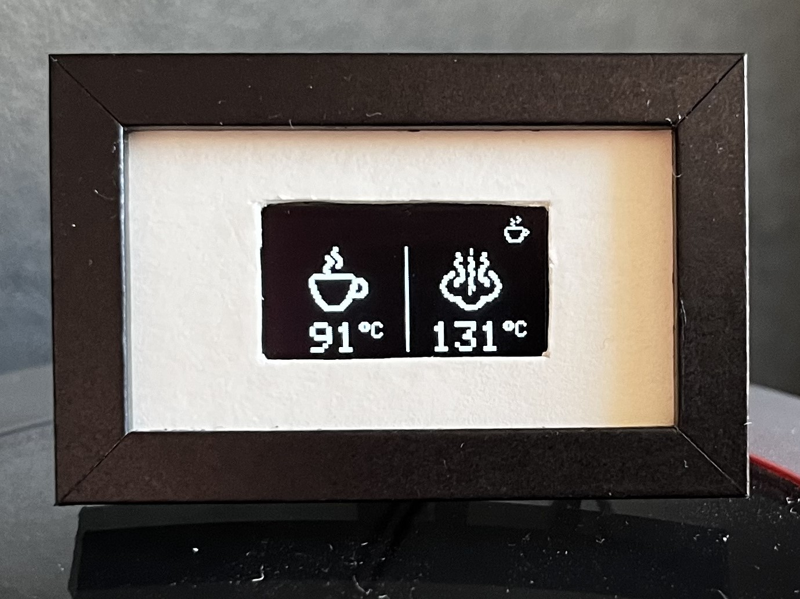

# Espresso Shot Timer for the Lelit Mara X (V2)
This is my tiny implementation of a shot timer for the Lelit Mara X (V2).

Shows Temperatures and Mode

Heatup

and a timer when the pump is working.

## Hardware:

-Arduino Nano

-0.96" SSD1306 OLED Display 128x64 Pixel

-Picture Frame

Cost: < 15€ (Germany)

## Wiring:
Top part shows the internal Gicar module of the Lelit Mara X.
Use CN9 for 12V Power and CN10 for GND and serial TX connection.

## Credits
Based on repos by @dougie996, @RedNomis and @SaibotFlow:

https://github.com/dougie996/M1N1MaraX_MQTT

https://github.com/RedNomis/MaraXObserver

https://github.com/SaibotFlow/marax-monitor
